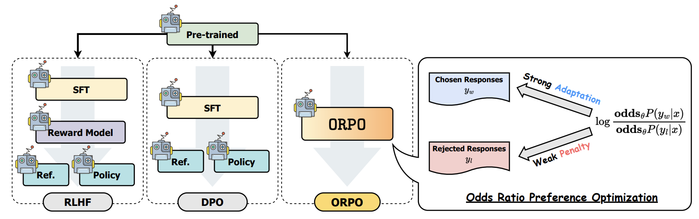

<div style="display: flex; flex-direction: column; align-items: center;">

<p style="text-align: center;">Fig a. Comparison of model alignment techniques.</p>
</div>

## **ORPO: Monolithic Preference Optimization without Reference Model**
Working on fine-tuning a model using [ORPO](https://arxiv.org/abs/2403.07691). 

The paper introduced a reference-free monolithic preference alignment method, odds ratio preference optimization (ORPO), by revisiting and understanding the value of the supervised fine-tuning (SFT) phase in the context of preference alignment. ORPO was consistently preferred by the fine-tuned reward model against SFT and RLHF across the scale, and the win rate against DPO increased as the size of the model increased.

## **Citation**
```bibtex
1. Hong, J., Lee, N., & Thorne, J. (2024). ORPO: Monolithic Preference Optimization without Reference Model. ArXiv. /abs/2403.07691
```